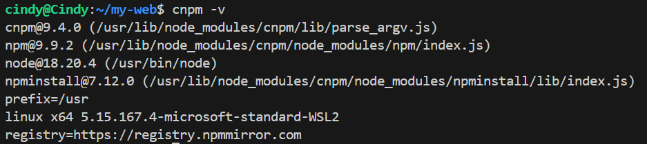

虽然我的博客现在还没有什么东西，但是不妨碍我屎盆子镶金边地加上搜索功能。

<!--more-->

## 安装依赖

前往博客的根目录，需要在命令行里输入以下代码：

```bash
cnpm install hexo-generator-search --save
```

使用`cnpm`是因为我的npm不能正常使用，所以换成了这个`npmjs.org`镜像。cnpm解决了中国大陆由于网络问题导致的 npm 包下载缓慢的问题，是可以替代官方版本的，个人使用下来还是蛮方便的。如果npm能很好下载就把命令前的cnpm改成npm即可。

### cnpm安装

这里小小放一下cnpm的安装~

#### 安装node

这个应该都是安装好的，不放心可以使用`node -v`检查一下。


#### 安装淘宝镜像

```bash
npm install -g cnpm -registry=https://registry.npm.taobao.org
```

这里有一个地方得注意，在下载cnpm之前，用npm下载可能会出现下面的问题：


这是因为npm的源还是国外的镜像源，不信可以用`npm config get registry`查看一下。应该可以看到命令行给出的还是官方的镜像源：https://registry.npmjs.org。

所以先用`npm config set registry https://registry.npmmirror.com`指令切换镜像源之后，再进行下载，会快很多。这里的镜像源是最新的镜像源，原域名https://registry.npm.taobao.org/ 在 2022.06.30 号下线，停止 [DNS](https://so.csdn.net/so/search?q=DNS&spm=1001.2101.3001.7020) 解析，用不了了。


#### 检查是否安装成功

```bash
cnpm -v
```



#### 其他方法

也可以通过下面的指令安装：

```bash
npm install -g cnpm
npm config set registry https://registry.npm.taobao.org
npm config get registry
```

即先安装cnpm，再切换到淘宝npm镜像源。

#### 其他

有时候可能会碰到安装cnpm一直卡住的问题，可能是因为npm版本过低。

```bash
npm install -g npm
```

执行以上命令更新npm，然后执行`npm -v`检查版本。

---

### ## 修改配置文件

修改站点配置文件`_config.yml`，添加下面的代码：

```yml
# search
search:
  path: search.xml
  field: post # post:文章范围、page:页面范围、all:覆盖所有
  content: true # 内容是否包含每一篇文章的全部内容
  template:  # ./search.xml 指定定制的XML模板
```

## 修改主题配置文件

在主题配置文件`_config.butterfly.yml`中修改以下内容：

```yml
search:
  # Choose: algolia_search / local_search / docsearch
  # leave it empty if you don't need search
  use: local_search
  placeholder:

  # Algolia Search
  algolia_search:
    # Number of search results per page
    hitsPerPage: 6

  # Local Search
  local_search:
    # Preload the search data when the page loads.
    preload: false
    # Show top n results per article, show all results by setting to -1
    top_n_per_article: 3
    # Unescape html strings to the readable one.
    unescape: false
    CDN:

  # Docsearch
  # https://docsearch.algolia.com/
  docsearch:
    appId:
    apiKey:
    indexName:
    option:
```

因为我使用的是`local_search`，所以我只需要在`use`后面加上`local_search`就好了。当然还有剩下两个配置选项，可能会更好用一点，但我不需要这些，所以没有去配置，具体配置情况可以看[Hexo + Butterfly 键入搜索功能 - 简书](https://www.jianshu.com/p/500e2e1e66c5)。

## 最后

重新编译运行就能看到最终效果啦！

```bash
hexo clean
hexo s
```

这样可以在本地端口看到效果。

```bash
hexo g -d
```

最后再布置到**GitHub**上就可以了~
